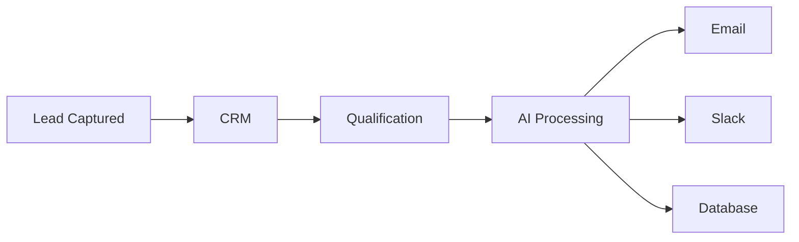

<div align="center">

# ⚡ PRAJJWAL NAG

### Building AI Agents, Automations & Data Systems That Actually Ship


---

```bash
> whoami

Prajjwal Nag
┣━━ AI Engineer
┣━━ Automation Developer
┣━━ Web Scraping Specialist
┣━━ Full Stack Builder
┗━━ Turning business chaos into automated systems
```

</div>

---

## 🧠 Current Focus

```python
focus = {
    "AI Agents": True,
    "LLM Applications": True,
    "RAG Systems": True,
    "n8n Automation": True,
    "Web Scraping": True,
    "Lead Generation": True,
    "Building Cool Stuff": True,
    "Sleeping Enough": False
}
```

---

## ⚙️ Tech Arsenal

### AI & Machine Learning


### Automation


### Development


### Infrastructure


---

## 🚀 What I Build

### 🤖 AI Agents

Autonomous systems that can:

- Research
- Reason
- Execute tasks
- Use tools
- Interact with APIs
- Generate reports

---

### 🔄 Business Automation



---

### 🕷️ Data Extraction Systems

- Browser Automation
- Anti-Bot Research
- Structured Data Collection
- Lead Enrichment
- Large Scale Scraping Pipelines

---

### 📚 RAG Systems

Transforming PDFs, Documents, CRMs, Emails and Knowledge Bases into searchable AI assistants.

---

## 📊 Github Stats

```txt
Lines of code written:       A lot
Bugs introduced:             Too many
Bugs fixed:                  Eventually
Coffee consumed:             Infinite
Projects abandoned:          Let's not discuss that
```

---

## 🔥 Philosophy

> Build things that save humans time.

AI should not be a demo.

AI should not be a buzzword.

AI should automate real work.

---

## 🌐 Let's Build Something

```bash
If your business has:
    repetitive tasks
    manual workflows
    disconnected systems
    too much copy-paste

Then we should talk.
```

---

<div align="center">

### ⚡ Automate Everything

*"Anything repetitive is a candidate for automation."*

</div>
